# Nick Jr. Anomaly Assets
The assets provided below are from the [V2](https://www.youtube.com/watch?v=1Up7GjHXoRY), for the V1 see [here](https://scratch.mit.edu/projects/845165084/).

I also have premission from [Seismo](https://www.youtube.com/@SeismosVideoCorner) to reupload the assets.

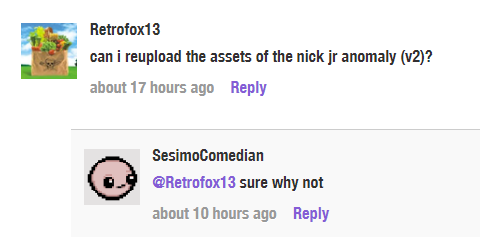

Glitched technical difficulties screen is made by [Puz](https://puz.neocities.org).

## Just a Nick Jr. logo, there is nothing wrong with it!

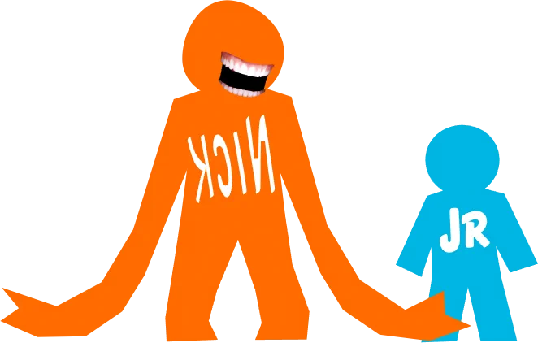

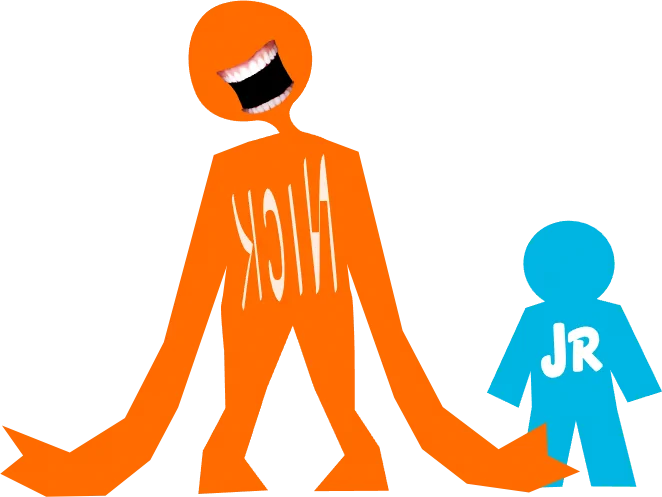

## Okay, something is really off...

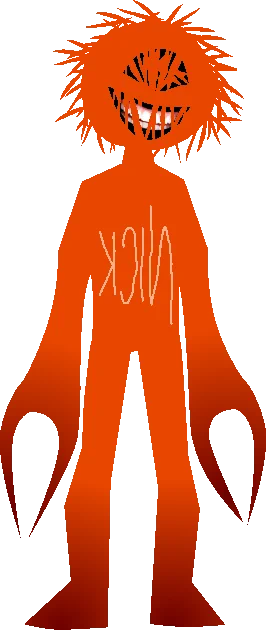

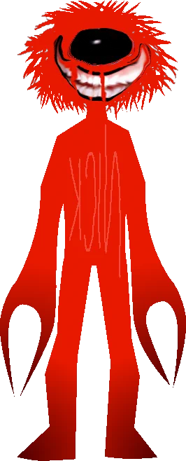

## Jr died, I guess...
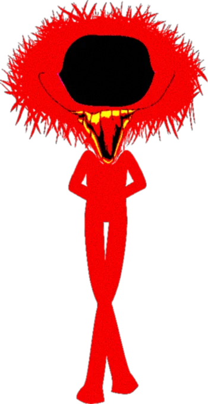

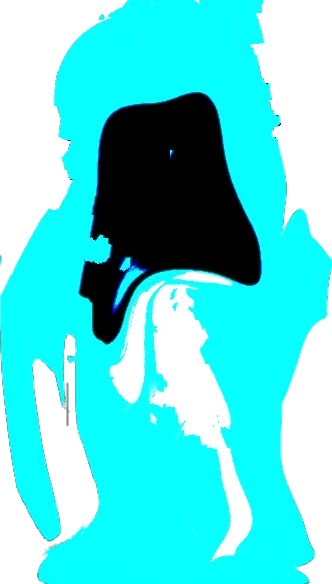

## Misc
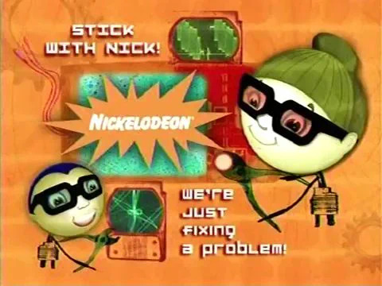

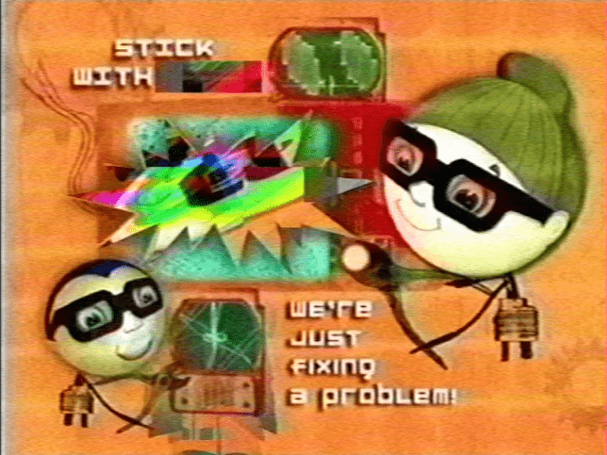

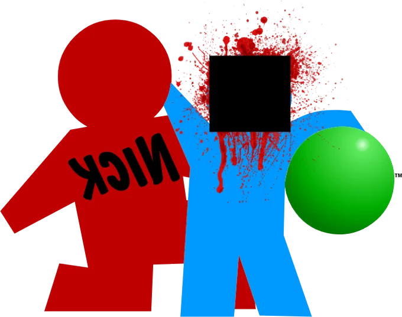

### Make sure to check out [the full series](https://www.youtube.com/playlist?list=PLLETAMxb4wBIcBTFnpvy4bRMn361HQos_) too!

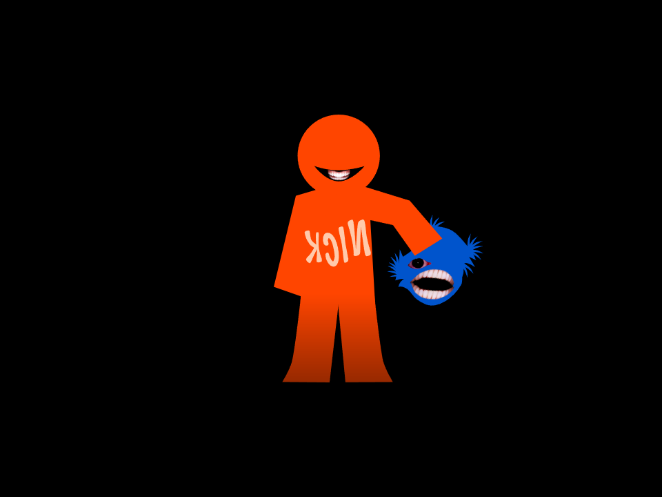

[it only gets worse from here](https://weird-vhs.marigold.town/fp-content/attachs/nickjr-19_08_2001.mp4)